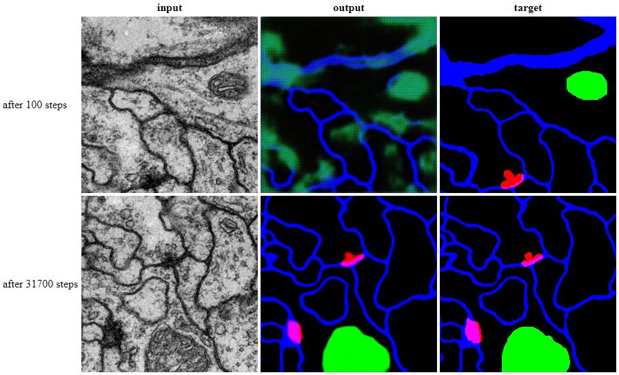

# Predicting membranes, mitochondria and synapses

## Typical result



## Preparation

Combine input and output images
```bash
python tools/process.py \
  --operation combine \
  --input_dir datasets/vnc/stack1/raw/ \
  --target_dir datasets/vnc/stack1/labels/ \
  --output_dir datasets/vnc/combined/
```
Split in training and evaluation set
```bash
python tools/split.py \
  --dir datasets/vnc/combined
```

## Training 

Train the classifier for the direction "AtoB" (EM images to labels) using paired-to-image translation with a residual net as the generator:
```bash
python imagetranslation/translate.py   --mode train \
  --input_dir datasets/vnc/combined/train \
  --output_dir temp/Example_2D_3Labels/train \
  --Y_loss square \
  --network resnet \
  --max_epochs 2000  --display_freq 50
```

The `--display_freq 50` will output an HTML file at `temp/Example_2D_3Labels/train/index.html` that shows input/output/target image sets every 50 steps.

*The training may take 1 hour using a GPU, without you will be waiting for a day to finish the training.*

Meanwhile you can follow the training progress using the tensorboard:
```bash
tensorboard --logdir temp/Example_2D_3Labels
```

## Predict **NEW**

Use the model to predict labels for new data
```bash
python imagetranslation/translate.py   --mode test \
  --checkpoint temp/Example_2D_3Labels/train \
  --input_dir datasets/vnc/stack2/raw \
  --output_dir temp/Example_2D_3Labels/predict \
  --image_height 1024  --image_width 1024
```
*It might take a while to load the model from the checkpoint, but computation is fast even without a GPU.*
The prediction run will output the **labels only**, at `temp/Example_2D_3Labels/predict` 

## Test

Test the model
```bash
python imagetranslation/translate.py   --mode test \
  --checkpoint temp/Example_2D_3Labels/train \
  --input_dir datasets/vnc/combined/val \
  --output_dir temp/Example_2D_3Labels/test \
  --image_height 1024  --image_width 1024
```
*It might take a while to load the model from the checkpoint, but computation is fast even without a GPU.*
The test run will output an HTML file at `temp/Example_2D_3Labels/test/index.html` that shows input/output/target image sets.


## Evaluation

Evaluate the model prediction for each channel on the four images in the test set.

### Synapses

Evaluate `--channel 0` (red channel) of the output on the test images:

```bash
python tools/evaluate.py \
  --predicted "temp/Example_2D_3Labels/test/images/*outputs.png" \
  --true "temp/Example_2D_3Labels/test/images/*targets.png" \
  --output temp/Example_2D_3Labels/test/evaluation-synapses.csv  --channel 0
```

or use the bash script which will output an summary image for each sample in the subdirectory `evaluation`:

```bash
bash tools/evaluate.sh temp/Example_2D_3Labels/test/images synapses
```


Typical values are RAND=0.490, MI = 0.309 for the membrane label.
The segmentation of individual mitochondria has an adjusted RAND=0.309,
precision = 1.000, recall = 0.347, F-Score = 0.502 and and adjusted RAND error = 0.497.

**There are no false positive synapses, but almost two third of them are not recognized (in a single section).**


### Mitochondria

Evaluate `--channel 1` (green channel) of the output on the test images:

```bash
python tools/evaluate.py \
  --predicted "temp/Example_2D_3Labels/test/images/*outputs.png" \
  --true "temp/Example_2D_3Labels/test/images/*targets.png" \
  --output temp/Example_2D_3Labels/test/evaluation-mitochondria.csv  --channel 1
```

or use the bash script which will output an summary image for each sample in the subdirectory `evaluation`:

```bash
bash tools/evaluate.sh temp/Example_2D_3Labels/test mitochondria
```


Typical values are RAND=0.891, MI = 0.757 for the membrane label.
The segmentation of individual mitochondria has an adjusted RAND=0.999,
precision = 0.961, recall = 0.911, F-Score = 0.935 and and adjusted RAND error = 0.065.

**Most of the mitochondria are correctly labelled and segmented.**

### Membranes and segmentation of neurons

Evaluate `--channel 2` (blue channel) of the output on the test images:

```bash
python tools/evaluate.py \
  --predicted "temp/Example_2D_3Labels/test/images/*outputs.png" \
  --true "temp/Example_2D_3Labels/test/images/*targets.png" \
  --output temp/Example_2D_3Labels/test/evaluation-membranes.csv  --channel 2  --segment_by 1
```

or use the bash script which will output an summary image for each sample in the subdirectory `evaluation`:

```bash
bash tools/evaluate.sh temp/Example_2D_3Labels/test membranes
```


Typical values are RAND=0.7850, MI = 0.629 for the membrane label.
The segmentation of neurons based on the membrane label (`--segment_by 1`) has an adjusted RAND=0.998,
precision = 0.912, recall =	0.962, F-Score = 0.936 and and adjusted RAND error = 0.064.

**The membrane label does not fully overlap with the ground truth.
However, the segmentation of neurons does not depend on minor variation of the membrane outlines.**


You might want to evaluate the neuron segmentation during the training:

```bash
bash tools/evaluate.sh temp/Example_2D_3Labels/train membranes
```

## Notes

A short description of the evaluation metrics can be found on the [SNEMI3D website](http://brainiac2.mit.edu/isbi_challenge/evaluation
) for which an [matlab implementation](SNEMI3D_metrics.m) is available.

Perhaps, other metrics could be used. See this comprehensive [survey](https://bmcmedimaging.biomedcentral.com/articles/10.1186/s12880-015-0068-x) for biomedical segmentation metrics which has been carried out using this [C implementation](https://github.com/Visceral-Project/EvaluateSegmentation).
